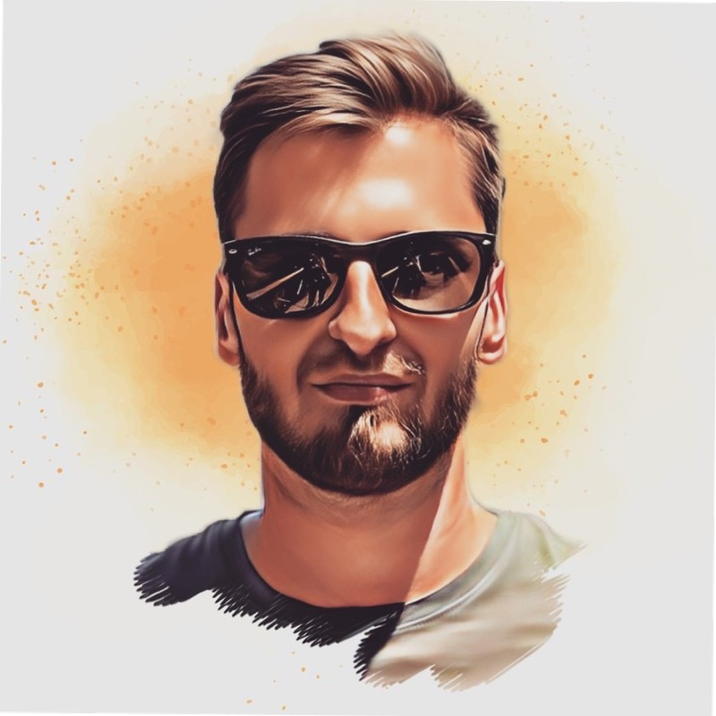
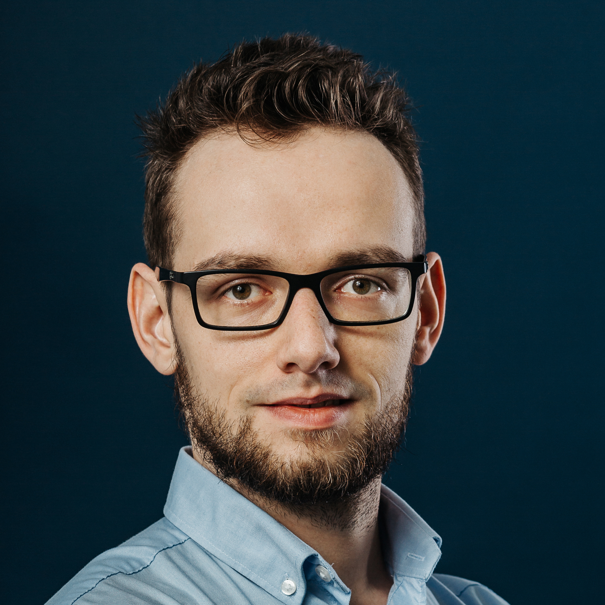

We write about leadership in software engineering.

## Kamil

Product-minded engineer, prior to joining Superside, engineering tech lead owning products facing 20M B2C customers. Experienced in building resilient distributed services with strong consistency guarantees.

Theoretical Computer Science alumni, with a background in mathematics and algorithms. Functional programming and strongly-typed languages enthusiast with heavy expertise in Scala language. Pragmatic TDD practitioner, effective async communication evangelist.

## Jakub

I am a product-minded software engineer and leader. I am interested in building solutions that solve important customer problems. I also
believe reliability is a feature both for clients and a healthy development team.

During my career, I served in multiple roles in the software development life cycle. I have experience as an engineer, tech lead, and team lead.
I worked at companies of different sizes and maturity. I started my career at big corporations like Google, Facebook, or Zendesk, and move 
now to a startup world. Currently, I'm employed at Superside. 

In my free time, I'm trying to understand the scientifc background behind cooking.

<a href="https://github.com/j-nowak"> <i class="about-fa-icon fab fa-github"></i>GitHub</a>
&#183;
<a href="https://www.linkedin.com/in/jakub-nowak-0909329b"> <i class="about-fa-icon fab fa-linkedin-in"></i>LinkedIn</a>
&#183;
<a href="mailto:pl.jakub.nowak@gmail.com"> <i class="about-fa-icon fa fa-envelope"></i>Email</a>
