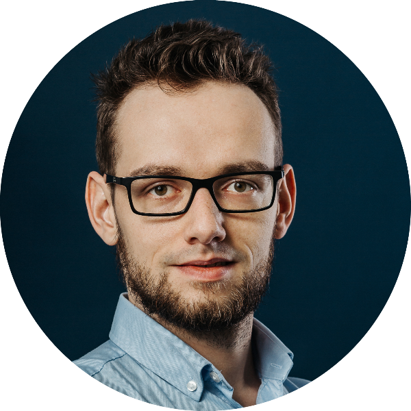

We write about leadership in software engineering.

## Kamil

Product-minded engineer, prior to joining Superside, engineering tech lead owning products facing 20M B2C customers. Experienced in building resilient distributed services with strong consistency guarantees.

Theoretical Computer Science alumni, with a background in mathematics and algorithms. Functional programming and strongly-typed languages enthusiast with heavy expertise in Scala language. Pragmatic TDD practitioner, effective async communication evangelist.

## Jakub

<!--  -->

I am a product-minded engineer. I have a strong background in theoretical computer science and mathematics. 

I am interested in building solutions that solve important customer problems. I advocate for a thoughtful decision process because everything is a tradeoff. I also believe reliability is a feature for both customers and a healthy development team. 

During my career, I served in multiple roles in the software development life cycle. I have experience as an engineer, tech lead, and team lead. 

I value honesty, transparency, and candid feedback. I bring a growth and collaboration mindset and help team members to perform at their best.

<a href="https://www.linkedin.com/in/jakub-nowak-0909329b"> <i class="fab fa-linkedin-in"></i></a>
<a href="https://github.com/j-nowak"> <i class="fab fa-github"></i></a>
<a href="mailto:pl.jakub.nowak@gmail.com"> <i class="fa fa-envelope"></i></a>
