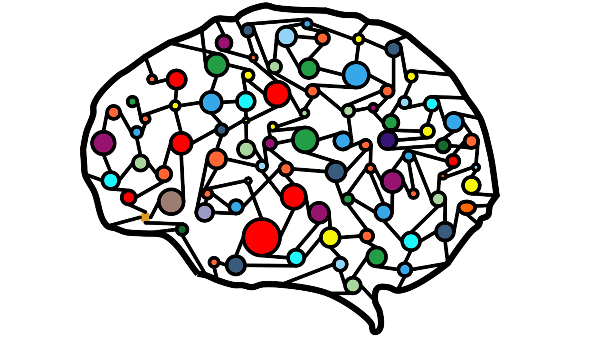
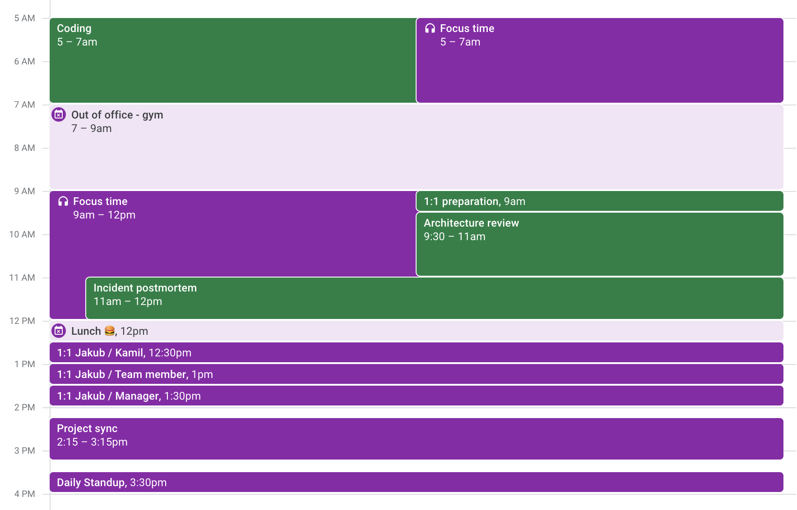

Transitioning into leadership often brings with it the challenge of managing a higher workload with limited time. You have more things to 
do in a smaller amount of time. Your individual work becomes more complex, less defined, and requires from you a lot of focus. 
Yet, you also have more meetings and more emails or messages to respond to. 

How can you stay on top of your work, help your team and have a healthy work-life balance at the same time? 
One solution to this challenge is a work methodology called **deep work**.

# What is deep work?


The term "deep work" was popularized by Cal Newport in a book 
[Deep Work: Rules for Focused Success in a Distracted World](https://www.calnewport.com/books/deep-work/).
It might sound fancy, but its meaning is very simple. I'm sure most of you have experienced it in the past, even if you don't know it. 
Simply put, deep work is the ability to concentrate deeply on a difficult problem to get it done efficiently. 

Cal Newport suggests the following, simplified equation for work:
```
Work Accomplished = Time Spent x Intensity
``` 
It makes a lot of sense. The more intense your focus will be, the higher your level of concentration - the better results you will yield in the 
same amount of time. The trick is to keep this high level of focus and concentration for a prolonged amount of time. 
Consistently and repetitively - every day, every week.

In this article, we'll cover how a little theory behind deep work and also share some of our personal experiences with it.

## Deep vs shallow work

There are two types of work we do as knowledge workers: deep and shallow work. Newport proposes the following definitions:
> **Deep work**
> Professional activities performed in a state of distraction-free concentration that pushes your cognitive capabilities to their limit. 
>These efforts create new value, improve your skill, and are hard to replicate.

_Examples of deep work: implementing a new feature, writing a thoughtful document, learning a new, difficult concept._

> **Shallow work**
> Non-cognitively demanding, logistical-style tasks, often performed while distracted. These efforts tend not to create much new value in 
> the world and are easy to replicate.

_Examples of shallow work: reading Slack, passively attending meetings, and filling out forms._

In general, work classified as _deep_ requires more cognitive effort from us than a shallow one. One might wonder whether a meeting can be 
classified as deep work. I believe it can be. It all depends on what you do during the meeting. If you're solving a particularly hard 
problem together and discussing important matters, then surely it is. On the other thing, if you're participating in some meetings just 
because "you have to" and don't necessarily bring or add value to it, then rather not.

# Benefits of deep work

Deep work can affect positively both your personal and work life. It can bring value in many different aspects. 
We believe the following are the most important:

1. **Increased focus and concentration.** By its definition, deep work is a state of distraction-free increased concentration. By practicing
deep work, your concentration increases.
2. **Getting things done.** The goal of deep work is to do more, high-quality work.
3. **Mastering your skillset.** It’s easier to learn new skills with high concentration. Getting things done quicker also leaves more time 
for additional learning.
4. **Job and life satisfaction.** Finishing your tasks and achieving goals can be deeply satisfying. Good time management can also 
positively impact your work-life balance.

# Getting started

Doing deep work is hard and requires a lot of effort, especially at the beginning. But its effects on work quality and life satisfaction can
be amazing. Approach deep work with an agile and flexible mindset. Every one of us is different and other things work better for us. Don't strive to 
perfectly copy routines others are practicing. Rather treat them as inspiration to create your own, bespoke practice.

The following principles can help you get started and establish your deep working routine:
1. **Clearly define what you want to accomplish.** Deep work requires very focused attention, you can’t work on multiple things at the same time.
2. **Schedule time for a deep work session.** Be realistic, about how long you can concentrate without interruptions.
3. **Remove distractions.** Close unnecessary browser tabs, and turn off notifications. Consider music, if it helps you to concentrate.
4. **Take short breaks.** Long stretches of intense concentration should be balanced with quality rest.
5. **Assess how you did and repeat.** Build your own deep work routine.

# Our experiences with deep work

We designed our own deep work routines with the principles mentioned above. They do differ a bit from each other but are suitable exactly 
for our own needs.

### Jakub's routine


- My peak performance and concentration are in the mornings between 5 am and 12 pm. That’s when I schedule my deep work sessions.
- My deep work sessions last usually between 1-2 hours. Sometimes during focus, I put on noise-canceling headphones and listen to music. 
Between sessions, I try to relax by doing a little stretching or playing with a dog. I try to defocus my brain completely from the cognitive effort.
- I **always** have all notifications turned off. The only exception is a phone call (in case of an emergency). When doing some shallow 
work, I turn on slack, email, etc.
- I plan a day (or a couple of days) of work & life ahead of time. I need to know what will be my deep work focus before I start it. I 
simply use Google Calendar for it.

### Kamil's routine


My goal was easily describable - `I wanted to limit the context switching and reserve time for the deep focus`. As a side effect, I expected 
to limit the `meeting gaps time`. 

> How could I still attend sync calls with the highest impact, while still being able to focus on individual contribution?

I was in quite good position, as most of my meetings were 1:1s
**What I did:**
- Dropped from the meetings on which my attendance had little impact
- Minimised time in big meetings 3+ guests in favor of 1:1, as the conversation pattern is more natural
- Stacked the meetings into bigger slots, to avoid gaps
- Picked a dedicated day (Friday) for async communication only, for the most demanding tasks
- Whenever I’ve got a demanding task that fits nicely into the ~6 hours of work, I plan it upfront for Friday.

# Summary

Producing new value, solving complex problems, and learning new concepts - are things, which usually require a lot of focus and effort 
from us. They are also very important, in becoming successful at work. Don't let distractions take control over your life or diminish your 
output. Try out deep work strategies and improve your productivity. Own your time and start planning work ahead. 

If you would like to learn more about deep work, please check the references linked below. You can find more details about the concepts we 
described in the articles and Newport's book. If you would like to take the learnings even further, we strongly recommend the article 
(and podcast) [Manage Your Energy, Not Your Time](https://codingsans.com/blog/manage-your-energy-not-your-time), where James Stanier presents
a concept of managing energy instead of just time.

# References
- https://www.calnewport.com/books/deep-work/
- https://timelyapp.com/blog/what-is-deep-work
- https://blog.doist.com/deep-work/
- https://codingsans.com/blog/manage-your-energy-not-your-time