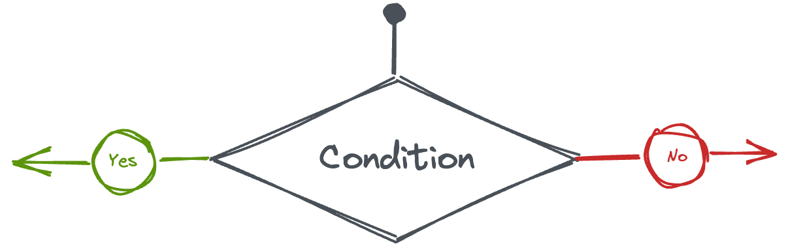
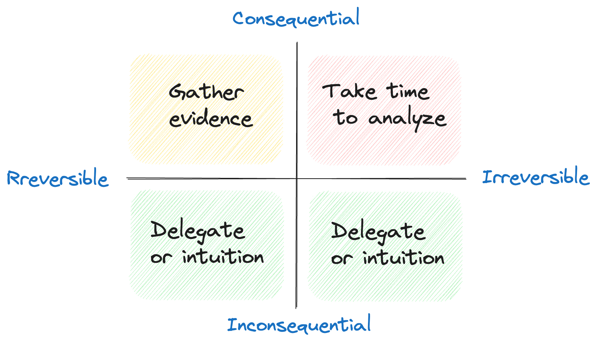
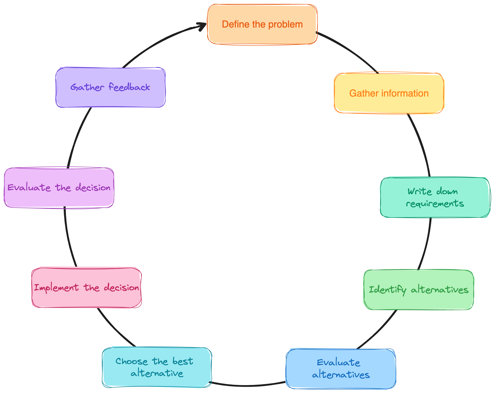
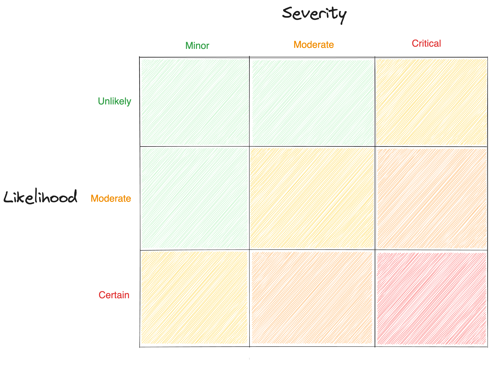

# Introduction

The ability to make effective decisions is a critical skill in today's fast-paced and complex world. Whether it's a personal choice or a business decision, making informed and well-thought-out decisions can have a significant impact on the outcomes. However, before embarking on any decision-making process, there are certain prerequisites that need to be met. 

In this post, we will discuss the **key decision-making prerequisites**, including defining the decision-making timeline, identifying the problem to solve, and discussing the types of decisions. We will also provide an overview of the decision-making **lifecycle** and **strategies** for effective decision-making including data-driven approaches, risk analysis, decision matrices, and seeking feedback.

# Decision-making prerequisites

Before embarking on a decision-making process, there are certain prerequisites that need to be met. They shape the process and enhance the likelihood of making informed and successful choices.

## Define the decision-making timeline
Defining the decision-making timeline is a critical step in the decision-making process. This involves establishing when the decision needs to be made and setting a deadline for taking action. Failure to define a timeline can lead to indecision, wasted resources, and missed opportunities. In some cases, **not making a decision can be worse than making the wrong decision**.

## Define the problem to solve
To make an effective decision, it's important to clearly define the problem that needs to be solved. This involves taking a step back and asking critical questions to ensure that you are addressing the root cause of the issue. **Remember about the [XY problem pitfall](https://xyproblem.info/)**: avoid jumping to conclusions or making assumptions about the problem without conducting a thorough analysis first. 

It's also important to note that defining the problem is an ongoing process. As new information becomes available, it's important to **reassess the situation and adjust your understanding** of the problem accordingly. This ensures that you are continually addressing the most **critical and relevant issues**.

## Define the type of decision
Not all decisions are created equal. Some have more **significant consequences**, while some are more **reversible**. Understanding the nature of the decision you're facing can help you approach it in a more effective way.

One useful tool for classifying decisions is the [Eisenhower Matrix](https://fs.blog/eisenhower-matrix/) and its variations. Eisenhower proposed to consider two aspects of a decision: if it’s important/non-important or urgent/non-urgent. We advise using a tweaked approach ([introduced by Farnam Street](https://fs.blog/decision-matrix/)) and categorizing them based on **reversibility and consequentiality**. 

How should we approach decisions in different quadrants? **Take time to analyze** consequential and irreversible decisions. Those have a long-lasting impact. For decisions that are consequential but reversible, invest in the effort to **gather additional evidence** that can lead to better outcomes. For all the others you can try **delegating** them or deciding based on your **experience or intuition**. They are a great possibility for less experienced people to learn more about the decision-making process.

# The Decision-Making Lifecycle

The decision-making process is typically comprised of multiple steps, and it's not always a linear progression. It's perfectly acceptable to **backtrack and revisit earlier stages in order to make further progress**. For instance, while evaluating alternatives, new information may come to light that is essential to solving the problem. This may prompt us to return back to identifying alternatives to explore new potential solutions. **Flexibility and adaptability** in the decision-making process can lead to more effective outcomes.

Here is an overview of the key steps in a typical decision process:
* **Define the problem**: Clearly define the problem or decision that needs to be made. It's important to have a clear understanding of the issue at hand before proceeding with the decision-making process.
* **Gather information**: Collect relevant information and data related to the problem. This may involve conducting research, consulting experts, and analyzing data to gather as much information as possible.
* **Write down requirements**: Define and document specific requirements related to the problem or decision at hand. This can include factors such as budget limitations, time constraints, stakeholder expectations, functional or technical requirements, and other relevant considerations. They will serve as a reference point for evaluating and comparing different alternatives.
* **Identify alternatives**: Generate a list of possible alternatives to address the problem. This may involve brainstorming, creative thinking, and considering different perspectives to come up with a range of possible solutions.
* **Evaluate alternatives**: Evaluate the alternatives against the requirements. This approach helps to avoid bias and provides an objective basis for comparison. A decision matrix should be used to assess each alternative based on how well it meets the established requirements. This process allows for a systematic and objective assessment of each alternative's strengths and weaknesses.
* **Choose the best alternative**: Based on the evaluation, select the best alternative that aligns with the defined problem, the available information, and the desired outcomes. Consider the long-term implications and feasibility of the chosen alternative.
* **Implement the decision**: Put the chosen alternative into action. Develop an action plan, allocate necessary resources, and execute the decision effectively.
* **Evaluate the decision**: Monitor and evaluate the results of the decision implementation. Assess whether the desired outcomes are being achieved and identify any deviations or areas for improvement.
* **Gather feedback**: Collect feedback from stakeholders, team members, or affected parties to gain insights into the effectiveness of the decision. This feedback can be used to refine future decision-making processes and improve decision outcomes.

Following this decision process lifecycle can help ensure a systematic and comprehensive approach to decision-making, leading to informed choices and successful outcomes.

# Strategies for Effective Decision-Making
In this section, we will explore several strategies for effective decision-making. These strategies include using **data-driven approaches**, **conducting a risk analysis**, **employing decision matrices**, and **seeking peer feedback** and **devil's advocate discussions**. They can be applied in various decision-making contexts, ranging from personal choices to business decisions and beyond.

## Data-Driven Decision-Making
Using data and relevant information as a basis for decision-making can help minimize biases and ensure a more objective approach. Analyzing data and drawing insights from it can provide valuable insights that inform decisions and help mitigate risks.

Firstly, assess whether data gathering and aggregation for your specific problem are feasible. If not, try exploring analogical problems with readily available data. Additionally, breaking the problem down into smaller, more manageable subproblems can often lead to more accessible and relevant information. **Being resourceful and creative in your data collection approach can greatly enhance your decision-making process**.

## Risk Analysis
Conducting a thorough risk analysis can aid in identifying potential issues and uncertainties, which we may encounter. Collaborating with a team to **conduct a [premortem session](https://www.atlassian.com/team-playbook/plays/pre-mortem)** can be highly beneficial. This involves envisioning a hypothetical scenario where the project or decision has failed and collectively brainstorming the possible reasons and obstacles that could have contributed to that outcome. By **proactively addressing potential risks** and challenges, you can better prepare for them and **mitigate their impact** on your decision-making process.

## Decision Matrix
A decision matrix is a useful tool that can assist in comparing and evaluating alternatives based on multiple criteria. By assigning weights and scores to different criteria, decision-makers can **objectively assess the strengths and weaknesses** of each alternative and determine the best course of action.

Adopting a decision matrix as an alternative to traditional pros and cons lists can be a more effective approach. It eliminates the potential inclusion of unrelated aspects in the evaluation process. Unlike pros and cons lists, a decision matrix allows for a **structured and organized comparison of different solutions**. 

| **Requirements** | **Priority** | **Solution A** | **Solution B** | **Solution C** |
|------------------|--------------|----------------|----------------|----------------|
| Requirement 1    | Must         | 🟢 Yes,...        | 🟢 Yes, ...       | 🔴 No             |
| Requirement 2    | Must         | 🟡 Partially, ... | 🔴 No             | 🟢 Yes, ...       |
| Requirement 3    | Should       | 🟢  Yes, ...       | 🔴 No             | 🔴 No             |
| Requirement 4    | Nice         | 🔴 No             | 🟢 Yes            | 🟢 Yes            |

## Peer Feedback and Devil's Advocate
Seeking feedback from peers or engaging in devil's advocate discussions can help to **challenge assumptions**, **uncover blind spots**, and **identify potential flaws** in the decision-making process. This can provide valuable insights and alternative perspectives that can improve the overall quality of the decision. Diverse perspectives help to reduce bias, which we may have for a certain solution.

# Summary
Effective decision-making requires certain prerequisites to be met before embarking on the process. These prerequisites include defining the **decision-making timeline**, clearly defining the **problem to solve**, and understanding the **type of decision** being made. The decision-making process typically involves gathering information, writing down requirements, identifying alternatives, evaluating alternatives, choosing the best alternative, implementing the decision, evaluating the decision, and gathering feedback. **Following a systematic and comprehensive approach to decision-making can lead to informed choices and successful outcomes**.

We have also discussed different strategies for effective decision-making including using **data-driven approaches**, conducting a **risk analysis**, employing **decision matrices**, and seeking **peer feedback**. These strategies can be applied in various decision-making contexts, from personal choices to business decisions and beyond. Being mindful of biases, considering long-term implications, and reassessing the problem as new information becomes available are also important aspects of effective decision-making. By incorporating these strategies and principles into the decision-making process, individuals can make informed and effective decisions in today's fast-paced and complex world.