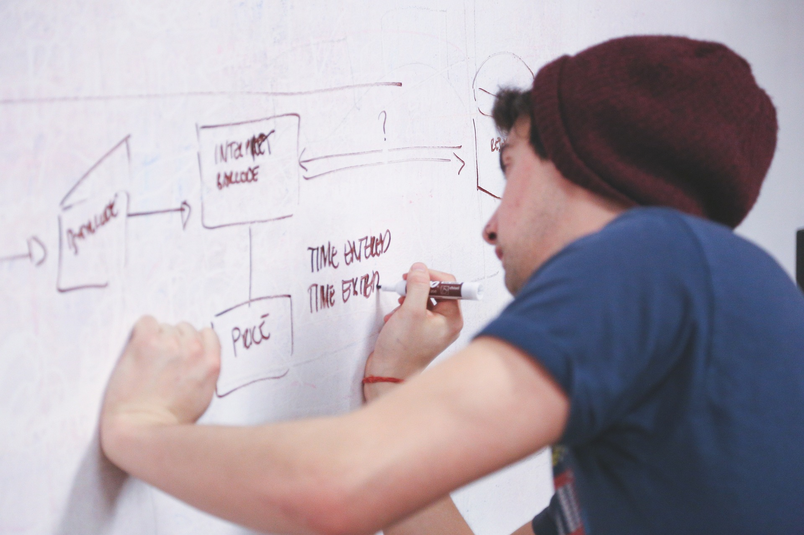

System design interviews are crucial components of the technical interview process, particularly for evaluating senior and staff+ candidates. When conducted effectively, this type of interview enables exceptional candidates to truly shine. **The main goal of a system design interview is to evaluate a candidate's ability to design or evolve a complex system within an underdefined scope.** Let the candidates showcase their passion, drive for technology, and technical leadership skills.

Conducting a successful system design interview can be a challenging process, even for experienced interviewers. To prepare for the interview and alleviate stress, it's important to have a clear understanding of the role requirements and the company's technical stack and architecture and to establish a structured plan for the interview.

# Goals of the system design interview

The system design interview shares similar high-level goals with other types of interviews. The primary objective is to assess whether the candidate has the necessary skills and expertise to perform the job effectively. **Additionally, the interview aims to evaluate the candidate's potential fit within the company's career ladder and assess whether they have the ability to raise the bar of talent within the organization.**

We recommend focusing on the following aspects:
* Assess the candidate's ability to build a system from scratch or evolve an existing solution.
* Grade their capacity to ideate the scope of the system and challenge the status quo.
* Examine their ability to make technical trade-offs and compare competing solutions, as well as their capacity to make pragmatic decisions.
* Scrutinize their understanding of the components of a complex system, and their ability to predict potential bottlenecks and find ways to avoid them.
* Judge their technical leadership and communication skills, which are essential for success in any technical role.

# Prepare the set of competencies you care about 

Once you have identified your high-level goals and company needs, the next step is to create a set of competencies to evaluate the candidates. We recommend doing this upfront to avoid creating a complex task with extensions that don’t assess the candidates effectively.

We find keeping the competencies list handy during the interview, so you can provide structured feedback to the candidates. Additionally, this list can help distinguish between mid, senior, and staff+ candidates. **Keep in mind that the candidate does not need to meet all the requirements listed for a particular level. The flow of these interviews is not always linear and can vary with different individuals.** However, more experienced candidates should be able to check off more competencies on the list than less experienced ones.

## Categories of competencies

We distinguish four groups of competencies, which can later be broken down into more granular categories:
* Problem understanding and communication
* Problem-solving
* Distributed systems knowledge
* Technical leadership

### Problem understanding and communication
**Engineers typically don't work in isolated, well-defined environments.** Rather, they should be involved from the early stages of product ideation and help define the problem to be solved along with its requirements. When evaluating candidates in this category, consider the following skills:
* Clear communication
* Inquisitive nature and willingness to ask questions
* Understanding of the business needs and the purpose of the product being built.

### Problem-solving
**It's null until you ship it!** Delivering and accomplishing tasks is a key characteristic of strong engineers. They possess the ability to tackle problems, persist through difficulties, and find solutions. To assess this competency during the interview process, here are some things to keep in mind:
* Keep the tasks granular and gradually evolve them in scope and complexity. 
* Keep them open-ended, letting more experienced candidates drive their path into the areas of interest.
* Touch base on technical difficulties as well. As the product grows, multiple pitfalls may arise around resiliency, challenging candidates against them.

### Distributed systems knowledge
While we may not always use NoSQL databases or advanced queuing systems, it's beneficial to at least have an understanding of how they work, what their costs are, and what they bring to the table.

#### Let the candidate ramp you up within their expertise
As interviewers, it's our responsibility to guide candidates and give them the opportunity to showcase their expertise. This can indicate that a candidate is invested in their work and has a good grasp of complex concepts. **Furthermore, more senior engineers may have deeper knowledge in certain areas than we do, so it's worthwhile to let them shine and teach us something.** If you spot such a scenario, let the candidate explain the concept to you - knowledge-sharing skills are essential for strong leaders.

### Technical leadership
Lastly, it's important to assess the candidate's skills in technical leadership. **This will help differentiate strong staff+ engineers from senior ones.** Look out for indicators such as:
* Their decision-making process and how they choose tools to solve problems. Strong product-oriented engineers should fit the solution to the problem, not vice-versa.
* Their design is customer-centric or technology-centric. It’s just perfect for certain staff archetypes to be technically excellent, though if you expect them to be product-minded, the priority shall always be on the customer. 
* They validate the scope of a problem and predict potential risks to the project. It’s necessary to ensure that the project they deliver makes sense and aligns with the stakeholders' objectives. Otherwise, it could be a big waste of time and resources for an organization to work on an accurate venture. 

On top of that, we expect them to effectively drive the conversation and proactively ask out about the areas in which the problem is underdefined. This mimics the real-life scenarios accurately and allows us to better understand how the individual approaches their scope of work. 

# Summary
In this article, we discussed the key elements of conducting an effective system design interview for software engineering candidates. **We emphasized the importance of first defining the high-level goals and competencies to evaluate, as well as considering the specific needs and challenges of the company.** We recommended breaking down the competencies to evaluate into four categories: 
Problem understanding and communication 
Problem-solving 
Distributed systems knowledge
Technical leadership 
We provided specific tips and indicators to look for when evaluating candidates across these competencies.

In the upcoming article, we will delve into the process of preparing an effective interview task for software engineering candidates. We will provide detailed guidance on how to create a well-structured and relevant task. Moreover, we will provide insights on how to assess the candidate's performance. Last but not least, we will discuss ways to improve the process in the future, such as soliciting feedback from interviewers and candidates alike. 

By following the best practices we'll share in this series of articles, you can ensure a more efficient and effective interview process that accurately evaluates the skills and abilities of your software engineering candidates.